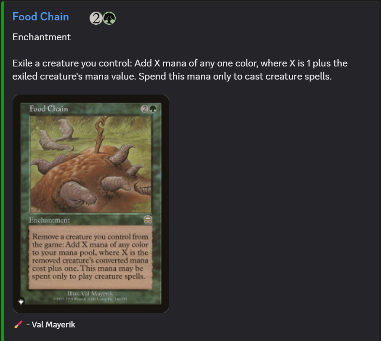

# A Magic the Gathering Card Fetching Bot

## Invite:
https://discord.com/oauth2/authorize?client_id=1315969494161559595&permissions=277025507328&integration_type=0&scope=bot

## Usage:

The Guessing Game:  
To play the guessing game use the /play command. This has two options: the set you want to pull the card from; and the difficulty (Easy, Medium, or Hard) this defaults to Medium.

To guess a card use the /guess command and the bot will tell you if you are correct or not (slight typos are forgiven so no need to be super accurate with spelling).

The more you get the card wrong the more of the card is revealed.

Searching for cards:  
You can use the /search command to search a card or do the following.

To search a card simply put your desired card in double square brackets: [[lightning bolt]]
Don't worry about slight misspellings as the bot with try and find the best match for what you have put

To refine your search you can specify artist/set (both set abbreviation and full name): [[lightning bolt | set=m11]] or [[relentless rats | artist = thomas m baxa]]

Additionally, you can put this mid-sentence as to not break your flow, as well as multiple in one message. For example:
I really love the artwork of [[the gitrog monster | set=bloomburrow commander]] it shows his true chonk, the classic [[gitrog monster | set=soi]] is not as cool.

All Commands:  
/search - Options: (set, artist) - Fuzzy search for the specified Magic the Gathering Card.  
/help - Options: () - Show this message.  
/play - Options: (set, difficulty) - Start a game of guess the Magic the Gathering card.  
/guess - Options: () - Make a guess for an active guess the card game.  
/give_up - Options: () - Give up on the current game and return the answer.  

Having issues or have suggestions?  
Please raise a ticket here https://github.com/i-h-bar/rustcord/issues

or if you don't want to use github please raise a ticket in this server
https://discord.gg/m9FjpPRAxt

This will bring images back like the following:  

